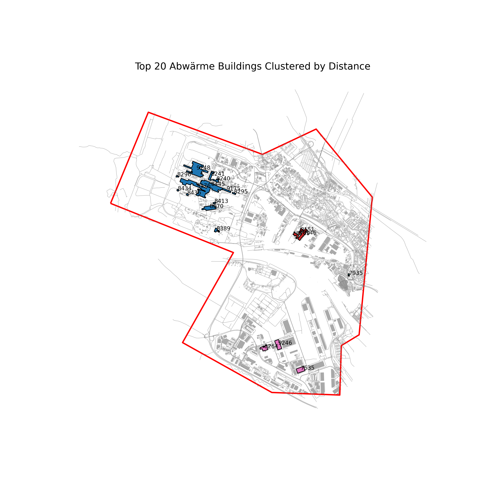
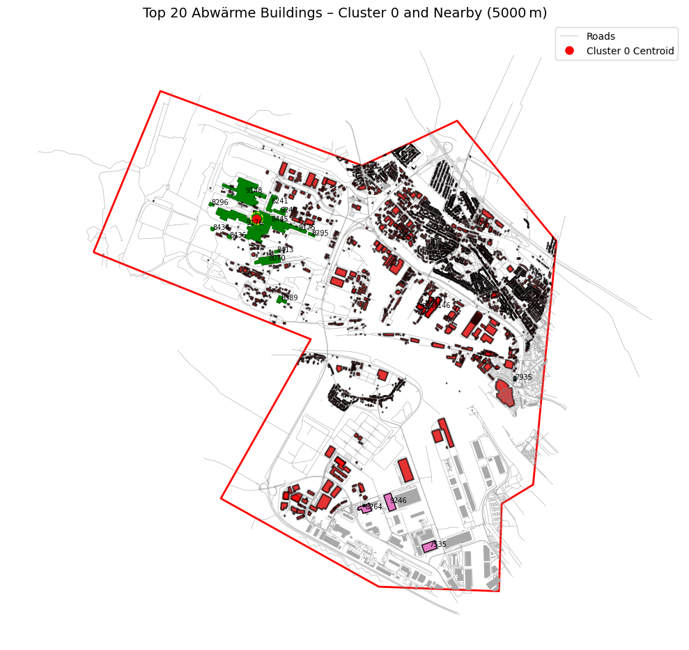
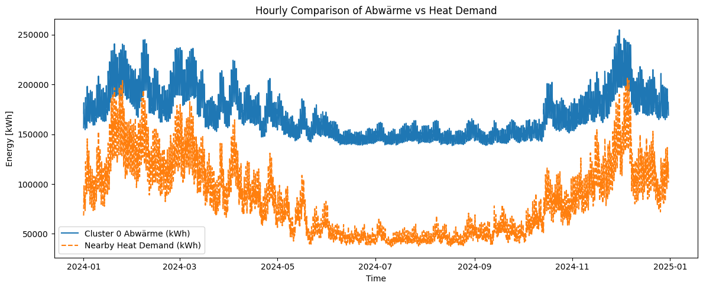

# hyBit_heat_waste_use
This repository contains a Python-based geospatial workflow developed within the hyBit - hydrogen for Bremen’s industrial transformation project. It supports municipal planners in identifying potential waste heat reuse zones and visualizing how industrial heat sources can efficiently meet nearby urban heat demands.

# Heat-Waste-to-Demand Matching Tool for Urban Energy Planning (hyBit Project)

## Overview

This repository contains a Python-based geospatial workflow developed within the **hyBit - hydrogen for Bremen’s industrial transformation** project. It supports municipal planners in identifying potential **waste heat reuse zones** and visualizing how industrial heat sources can efficiently meet nearby urban heat demands.

The tool clusters the most significant industrial heat sources (Abwärme), computes buffer-based coverage of heat demand in surrounding buildings, and visualizes both temporal and spatial heat match potential. The project focuses on the **Bremen industrial region** as part of a broader national hydrogen transition strategy funded by the German Federal Ministry of Education and Research (BMBF).

---

## Key Capabilities

* ✍️ **Load and preprocess GIS and energy data** (buildings, roads, industrial sources, building demands).
* ⚖️ **Cluster top industrial waste heat emitters** using distance-based methods (Agglomerative Clustering).
* 🗺️ **Visualize urban topology** with clustered sources, roads, building types, and heat coverage zones.
* 📊 **Compare hourly load profiles** of available industrial heat vs. aggregated building demand.
* 🌡️ **Identify optimal buffer zones** where the majority of heat demand can be met without overconsumption.
* 🔍 Automatically prioritize **buildings with lowest demand** to maximize reuse without exceeding capacity.
* 🔧 Scalable: Built with Pandas, GeoPandas, Matplotlib, scikit-learn and Jupyter.

---
## Repository structure
      .
      ├── Abwaerme_nutzung.ipynb              <- Main notebook with all analyses and plots
      ├── input/                              <- Input datasets (GeoJSONs, CSVs)
      │   ├── df_LP_geschossanzahl_hyBit.geojson
      │   ├── df_abwaerme_hyBit.csv
      │   ├── df_lp_heat_hybit.csv
      │   ├── gdf_area.geojson
      │   ├── gdf_road.geojson
      │   ├── polygon.geojson
      │   └── roads.geojson
      ├── output/                             <- Generated plots and results
      │   ├── Hourly comparison of heatwaste vs heat demand.png
      │   ├── clustered_abwaerme_buildings.png
      │   └── top_20_heat_waste_sources.png
      ├── structure.txt                       <- Repository file tree


---

## Why This Helps Municipal Energy Planning

This tool supports the strategic goal of defining **Abwärmenutzungsgebiete** (waste heat utilization zones) as an official planning category in Bremen’s Kommunale Wärmeplanung (municipal heat strategy). It enables:

* **Evidence-based zoning**: Shows which buildings can practically benefit from industrial waste heat.
* **Efficient infrastructure planning**: Buffer-based logic avoids over-dimensioned or underused connections.
* **Energy neighborhood insights**: Encourages spatial energy exchanges in industrial-residential proximities.
* **Net-zero acceleration**: Reduces primary energy use by locally reusing industrial waste heat.

---

## Folder Structure

```
input/               # All raw data files (heat sources, roads, building loads, etc.)
output/              # Automatically generated files (clustered buildings, plots, tables)
notebooks/           # Optional Jupyter notebooks for step-by-step exploration
src/                 # Modularized functions (future step)
README.md            # This file
LICENSE             # Project license (optional)
```

---

## Data Requirements

* `df_abwaerme_hyBit.csv`: Waste heat sources (ID, NACE code, hourly heat profile)
* `df_lp_heat_hybit.csv`: Building-level hourly heat demand profiles
* `df_LP_geschossanzahl_hyBit.geojson`: Building footprints and metadata
* `roads.geojson`: Road network for proximity analysis
* `gdf_area.geojson`: Study boundary (used to clip and constrain)

---

## How to Use This Repository

1. **Set up environment**:

   ```bash
   pip install pandas geopandas scikit-learn matplotlib shapely
   ```

2. **Place input files** in the `input/` folder.

3. **Run the main script** or Jupyter notebook. It will:

   * Load and process spatial and load data
   * Cluster top Abwärme sources
   * Assign buffer zones
   * Match buildings by load priority
   * Visualize results and store them in `output/`

4. **Use output GeoJSON or PNG files** for integration into urban planning tools or reports.

---

## Example Visualizations

### 1. Clustered Waste Heat Sources



### 2. Spatial Coverage of Demand within Buffer



### 3. Hourly Load Comparison



---

## Limitations

* Currently supports **static analysis for one city area** (e.g., Bremen).
* **Assumes hourly profiles in the same time zone** and duration.
* **Linear distance and buffering only**; no road network cost routing (can be added).
* Only selects **top-N emitters**; smaller sources are excluded.
* No direct temperature-level feasibility check (i.e., matching low- vs high-grade heat).

---

## Future Work

* Integrate **network optimization algorithms** (e.g., cost-distance, routing).
* Couple with **economic and emissions estimators**.
* Add **GUI interface** for municipal planners.
* Expand to **multi-city heat integration assessment**.

---

## About hyBit

> The hyBit project (Hydrogen for Bremen’s Industrial Transformation) is a large-scale initiative coordinated by the University of Bremen and funded by Germany’s BMBF. It promotes sustainable hydrogen and heat reuse strategies as part of Bremen’s decarbonization roadmap. The Hochschule Bremen develops spatial analysis tools for identifying heat reuse areas near the ArcelorMittal steel plant and beyond.

More info: [hybit_project_HSB](https://www.hs-bremen.de/forschen/forschungs-und-transferprofil/forschungsprojekt/verbundvorhaben-hybit-hydrogen-for-bremens-industrial-transformation/)

---

## License

This repository is released under the MIT License.

---

## Acknowledgements

Thanks to the hyBit partners and BMBF for funding this research.

Created by Hochschule Bremen Energy Planning Team.

